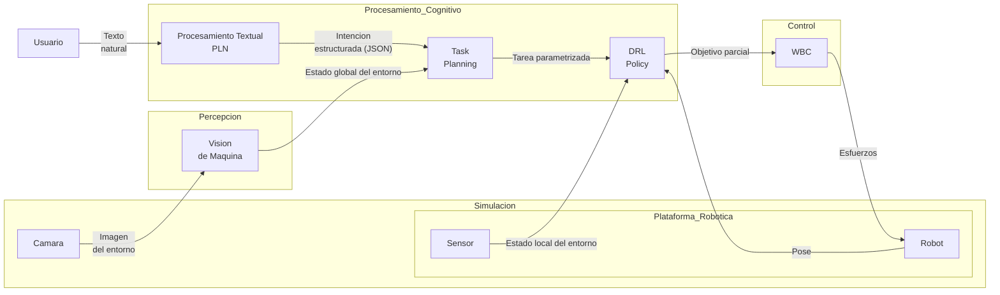

# Tesis: Control de Robot Manipulador Móvil con WBC e Inteligencia Artificial

## Archivos importantes

Archovs relevantes para EVITAR RELEER TODO EL PROYECTO PARA NO PERDER TOKENS

* data/data.md -> Información sobre los archivos del proyecto (será actualizado cada vez que sea necesario) 
* context/context.md -> Información técnica del proyecto y contexto para general

## Descripción del Proyecto

Sistema multi-agente para el control de un robot manipulador móvil basado en ROS Melodic. El robot es controlado por un **Whole-Body Controller (WBC)** y se integra con módulos de IA para procesamiento de lenguaje natural, planificación de tareas y navegación autónoma mediante aprendizaje por refuerzo profundo.

---

## Arquitectura General

---

## Módulos

### Módulo PLN — Procesamiento de Lenguaje Natural
- **Responsabilidad:** Recibe los comandos de texto, los procesa y da un JSON estructurado. Esto se hará con BERT (o uno mas simplificado para costo computacional) 
- **Entrada:** Texto del usuario (texto).
- **Salida:** Comandos/intenciones estructuradas en JSON estructurado hacia el Módulo de Task Planning.
- **Stack:** BERT o similar

### Módulo Task Planning — Planificación de Tareas
- **Responsabilidad:** RRecibe la tarea de alto nivel y el estado del entornoy la desglosa en pequeñas subtareas que se presentaran como objetivos. En un principio lo hará de manera jerarquica (se le podria implementar HRL pero eso está fuera del alcance del proyecto, por lo cual no es requerido pero seria un plus)
- **Entrada:** Comandos estructurados del módulo PLN.
- **Salida:** Secuencia de objetivos hacia el módulo DRL.
- **Stack:** HRL o uno simple (No es el objetivo del proyecto)

### Módulo DRL — Deep Reinforcement Learning
- **Responsabilidad:** Recibe la subtarea, el estado del entorno y la pose del robot y empieza con la navegación adaptativa hasta el objetivo. Esto se hará con PPO y SAC para comparar métricas.
- **Entrada:** Objetivos/waypoints del módulo Task Planning.
- **Salida:** Comandos de control de movimiento hacia el robot (Torques (Manipulador) y Velocidades (Robot mobil)).
- **Stack:** PPO o SAC (se debe comparar con metricas)

### Módulo Robot — Simulación
- **Responsabilidad:** Simular el robot manipulador móvil controlado por WBC en Gazebo.
- **Entorno:** Docker con Ubuntu + ROS Melodic + Gazebo.
- **Robot base:** Manipulador móvil con Whole-Body Controller (WBC).

---

## Entorno de Desarrollo

### Docker / ROS Melodic
- El robot simulado corre dentro de un contenedor Docker con Ubuntu y ROS Melodic.

### Dependencias del Workspace ROS
- ROS Melodic
- Gazebo

---

## Notas para Claude

- Este proyecto es una tesis de profundización.
- Los módulos son desarrollados de forma modular e independiente; respetar las interfaces entre ellos.
- Se busca usar websockets con Python y tuneles para la comunicación con el robot.
- El robot corre en simulación (Gazebo) dentro de Docker; no hay hardware real involucrado por ahora.
- Preferir soluciones que funcionen dentro del contenedor Docker sin dependencias externas no declaradas.
- **Bitácora:** Cada 5-7 interacciones o cambios significativos, agregar una entrada resumida en `Bitacora/` con la fecha como nombre de archivo (e.g. `Bitacora/29-03-2026.md`). Usar el formato del archivo existente. El objetivo es tener trazabilidad de los avances del proyecto.
- **Validación en simulación:** Cuando un cambio requiera ser validado corriendo el robot en Gazebo (e.g. modificaciones al WBC, launch files, parámetros del controlador), avisar explícitamente al usuario antes de continuar.
- **WBC es de otra tesis:** No proponer ni realizar cambios en `Stack_Tasks.cpp`, `Mob_Manipulator_Controller.cpp` ni en la lógica OSC salvo que sea estrictamente necesario y el usuario lo confirme. Tratar el WBC como caja negra.
