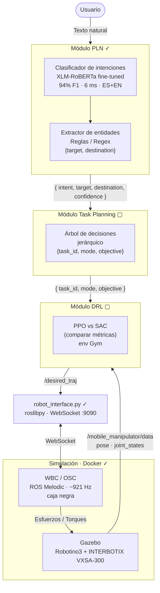

# Tesis - Maestria en Automatizacion Industrial

## Autor: Ing. Andres Camilo Torres Cajamarca

---

## Arquitectura del Sistema

### Estado de componentes

| Componente | Estado | Tecnología |
|---|---|---|
| Módulo PLN | **Completo ✓** | XLM-RoBERTa, 3 clases atómicas, 94% F1 |
| robot_interface.py | **Completo ✓** | roslibpy, rosbridge WebSocket |
| WBC + Gazebo + Docker | **Completo ✓** | ROS Melodic, ~921 Hz headless |
| Task Planning | Por desarrollar | Árbol de decisiones jerárquico |
| DRL | Por desarrollar | PPO vs SAC (Gymnasium) |
| Integración end-to-end | Por desarrollar | — |
